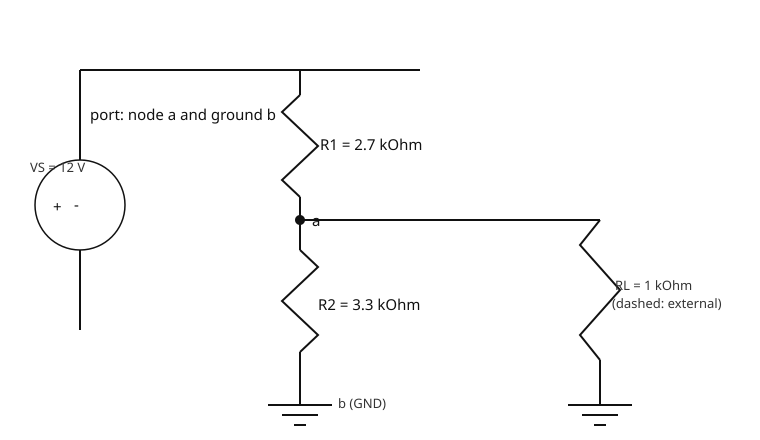
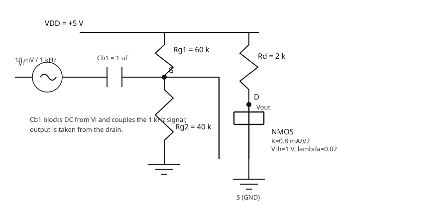
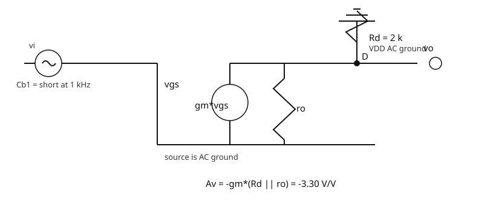

# 大一考核：进阶挑战（PySpice 三个电路）与提交说明

本仓库对应任务书第五节的 **PySpice 电路方案**，并把第六节的仓库/README
要求整理成可直接使用的模板。第五节要求“两个任务选做一个”，本仓库选择的是：

> 使用 PySpice 完成 ① RC 低通滤波、② 验证戴维南定理、③ NMOS 共源级放大电路。

三个电路都要做，都要放进 README。

## 1. 仓库结构

```text
.
├── README.md
├── LICENSE
├── requirements.txt
├── rc_lowpass.py            # ① RC 低通
├── thevenin.py              # ② 戴维南定理验证
├── nmos_common_source.py    # ③ NMOS 共源放大
└── figures/
    ├── rc_lowpass_circuit.svg
    ├── rc_lowpass_transient.png      # 运行脚本后生成
    ├── rc_lowpass_bode.png           # 运行脚本后生成
    ├── thevenin_original.svg
    ├── thevenin_equivalent.svg
    ├── nmos_common_source.svg
    ├── nmos_dc_path.svg
    ├── nmos_small_signal.svg
    ├── nmos_transient.png            # 运行脚本后生成
    └── nmos_ac.png                   # 运行脚本后生成
```

本目录放在总仓库 `my-task/task5-6/` 下。个人简介 PDF、个人主页
`index.html`、贪吃蛇等作品位于仓库根目录：

```text
../自我介绍.pdf
../index.html
../snake.html
../README.md
```

## 2. 如何运行

建议在 Windows 上先安装正式版 Python，再从 Microsoft Store 自动安装的
`python` 入口只会给出引导页。

```bash
python -m pip install -r requirements.txt
```

再安装 Ngspice，并把 `ngspice.exe` 所在目录加入 `PATH`。PySpice 会调用
Ngspice 作为后端仿真器。

三个脚本都可以在仓库根目录独立运行：

```bash
python rc_lowpass.py
python thevenin.py
python nmos_common_source.py
```

脚本会打印“理论值 vs 仿真值”表格，并把 CSV 数据和 PNG 图保存到
`figures/`。把终端输出的仿真数值回填到本 README 的对比表，即可完成提交。

## 3. ① RC 低通滤波器

### 3.1 电路图

自选参数：

- `R = 1 kOhm`
- `C = 100 nF`
- 输入：`1 kHz` 方波，幅度 `+-1 V`


### 3.2 手算

```text
tau = R*C = 1k * 100n = 100 us

fc = 1/(2*pi*R*C)
   = 1/(2*pi*1k*100n)
   = 1.592 kHz

高频时：|H| = 1/(2*pi*f*R*C)，增益以 -20 dB/decade 下降。
在 fc 处：|H| = 1/sqrt(2) ≈ 0.707，对应 -3.01 dB，相位 -45 deg。
```

### 3.3 瞬态波形与波特图

运行脚本后会生成：

- `figures/rc_lowpass_transient.png`
- `figures/rc_lowpass_bode.png`
- `figures/rc_lowpass_bode_phase.png`

### 3.4 手算 vs 仿真

| 指标 | 理论值 | 仿真值 |
| --- | --- | --- |
| `tau` | `100 us` | `100.0 us`（瞬态指数段拟合） |
| `fc` | `1.592 kHz` | `1.573 kHz`（AC 最近扫描点） |
| `fc` 处增益 | `-3.01 dB` | `-2.96 dB` |

## 4. ② 验证戴维南定理

### 4.1 含源二端网络

自选参数：

- `VS = 12 V`
- `R1 = 2.7 kOhm`
- `R2 = 3.3 kOhm`
- 端口 `a-b`，`b` 接地
- 外接负载 `RL = 1 kOhm`



### 4.2 戴维南等效


### 4.3 手算

```text
开路电压：
V_oc = VS * R2/(R1+R2)
     = 12 * 3.3/(2.7+3.3)
     = 6.6 V

短路电流：
I_sc = VS/R1 = 12/2.7 = 4.444 mA

等效电阻：
R_th = V_oc/I_sc = 6.6/4.444m = 1.485 kOhm
     = R1||R2 = 2.7k||3.3k

原电路接 RL 后：
I_load = 6.6/(1.485k+1k) = 2.656 mA
V_load = I_load*RL = 2.656 V

用 Vth=6.6 V、Rth=1.485 kOhm 替换原网络后，
RL 两端电压和电流应与原电路一致。
```

### 4.4 手算 vs 仿真

运行 `thevenin.py` 后，把脚本输出的 `V_oc`、`I_sc`、`R_th`、原电路负载电压/
电流、等效电路负载电压/电流填入下表。

| 指标 | 理论值 | 仿真值 |
| --- | --- | --- |
| `V_oc` | `6.6 V` | `6.6000 V` |
| `I_sc` | `4.444 mA` | `4.4444 mA` |
| `R_th` | `1.485 kOhm` | `1.4850 kOhm` |
| 原电路 `V_load` | `2.656 V` | `2.6559 V` |
| 原电路 `I_load` | `2.656 mA` | `2.6559 mA` |
| 等效电路 `V_load` | `2.656 V` | `2.6559 V` |
| 等效电路 `I_load` | `2.656 mA` | `2.6559 mA` |

## 5. ③ NMOS 共源级放大电路

题给固定参数：

```text
VDD = 5 V
Rg1 = 60 kOhm
Rg2 = 40 kOhm
Rd  = 2 kOhm
Cb1 视为足够大
NMOS: K = 0.8 mA/V^2, V_th = 1 V, lambda = 0.02 /V
输入: Vi = 10 mV / 1 kHz 正弦
```

### 5.1 电路图



本脚本取 `Cb1 = 1 uF`。在 `1 kHz` 时：

```text
X_Cb1 = 1/(2*pi*1k*1u) ≈ 159 Ohm
Rg1||Rg2 = 60k||40k = 24 kOhm
```

电容阻抗远小于栅极等效电阻，因此可作为“足够大的耦合电容”处理。

### 5.2 直流通路


手算静态工作点：

```text
VG = VDD*Rg2/(Rg1+Rg2)
   = 5*40k/(60k+40k)
   = 2 V

V_GS = VG = 2 V
V_ov = V_GS - V_th = 1 V

先忽略 lambda：
ID = K*V_ov^2 = 0.8m*1^2 = 0.8 mA
V_DS = VDD - ID*Rd = 5 - 0.8m*2k = 3.4 V

饱和条件 V_DS > V_ov：3.4 > 1，成立。
```

题目给了 `lambda = 0.02 /V`，所以更精确地计入沟道长度调制：

```text
ID = K*V_ov^2*(1 + lambda*V_DS)
   = 0.8m*(1 + 0.02*V_DS)

再代 V_DS = 5 - 2k*ID：
ID ≈ 0.8527 mA
V_DS ≈ 3.2946 V
```

### 5.3 小信号等效模型



```text
gm = 2*K*V_ov*(1 + lambda*V_DS)
   ≈ 1.705 mS

ro = 1/(lambda*ID) ≈ 58.7 kOhm

Av = -gm*(Rd || ro)
   ≈ -3.30 V/V
```

### 5.4 仿真模型说明

Ngspice 的 Level-1 MOSFET 饱和区电流公式是：

```text
ID = (KP/2)*(W/L)*(V_GS - V_th)^2*(1 + lambda*V_DS)
```

为了让模型与题目给出的 `K = 0.8 mA/V^2` 一致，脚本采用
`KP = 2*K = 1.6 mA/V^2`、`W = L = 1 um`：

```text
ID = (1.6m/2)*1*(1)^2*(1 + lambda*V_DS)
   = 0.8m*(1 + lambda*V_DS)
```

### 5.5 手算 vs 仿真

运行 `nmos_common_source.py` 后，把脚本打印的 OP、AC、瞬态结果填入下表。

| 指标 | 理论值 | 仿真值 |
| --- | --- | --- |
| `V_GS` | `2.0 V` | `2.0000 V` |
| `I_D` | `0.8527 mA` | `0.8527 mA` |
| `V_DS` | `3.2946 V` | `3.2946 V` |
| 饱和区判断 | `V_DS > V_ov`，饱和 | `V_DS = 3.2946 V > 1 V`，饱和 |
| `gm` | `1.705 mS` | `1.7054 mS` |
| `ro` | `58.7 kOhm` | `58.64 kOhm` |
| `Av`（AC 1 kHz） | `-3.30 V/V` | `-3.3049 V/V` |
| `Av`（瞬态反相验证） | `-3.30 V/V` | `3.3047 V/V`，相位差约 `-180 deg` |

输入输出波形保存在 `figures/nmos_transient.png`，应看到输出幅度约为输入的
3.3 倍、相位反相。

## 6. 任务六：提交材料整理

截止前需要把仓库链接发到群里收集表。仓库应包含：

1. `personal/个人简介.pdf`：姓名、专业、兴趣、联系方式等，内容自定义。
2. 仓库根目录的 `index.html`：个人网站全部 HTML/CSS/JS 代码，并已部署到
   GitHub Pages，网址见本 README 第 6.6 节。
3. 本任务三个 `.py` 文件、`README.md`、`figures/`、`LICENSE`。

### 6.1 提交前清单

- [ ] 把本仓库推到 GitHub，分支数量至少为 2（可用一个 `dev` 开发分支）。
- [ ] `git commit` 至少 3 次。
- [ ] 开启 GitHub 两步验证。
- [ ] `LICENSE` 中的姓名/年份改为自己的。
- [ ] 个人简介 PDF 与个人网站代码放入仓库并写网址。
- [ ] 本机运行三个 PySpice 脚本，把仿真数值和 PNG 波形回填/提交。
- [ ] 通读本 README，确认每个“为何这样做/踩了什么坑”都是自己能讲明白的。

### 6.2 新增/修改了什么

针对第五、六节，本仓库新增：

- `rc_lowpass.py`：RC 低通的方波瞬态和 AC 扫描。
- `thevenin.py`：原网络开路/短路/接负载与戴维南等效电路验证。
- `nmos_common_source.py`：直流 OP、1 kHz 瞬态、AC 扫描。
- `figures/*.svg`：三个电路图及 NMOS 直流通路/小信号模型。
- `README.md`：任务说明、手算、运行方法、AI 使用记录。

同一仓库里的个人简介、个人网站、小游戏等属于前几节任务；如果合并提交，
应按同样格式补一小节说明每个目录改了什么及原因。

### 6.3 踩过的坑与解决

以下记录建议保留并补上你实际运行时的版本：

1. Microsoft Store 的 `python.exe` 只是启动器，直接 `pip` 会失败。解决：
   安装正式版 Python，并勾选 Add Python to PATH。
2. PySpice 安装后不会自动装 Ngspice。需要单独安装 Ngspice，并确保
   `ngspice.exe` 能被命令 `ngspice --version` 找到。
3. 题目 `K = 0.8 mA/V^2` 不等于 SPICE Level-1 的 `KP`。
   SPICE 公式含 `1/2`，所以应写 `KP = 2*K = 1.6 mA/V^2`，否则仿真电流会
   只有理论值的一半。
4. 大耦合电容会让瞬态起始段出现缓慢充电。脚本分析稳态段，并保留足够长的
   瞬态时间；若改动参数，应重新检查分析窗口。

### 6.4 AI 使用与人工调整记录

`rc_lowpass.py`、`thevenin.py`、`nmos_common_source.py` 的初版由 AI 生成；
电路图 SVG 与本文 README 也由 AI 整理。提交前请逐行复核，并把你实际改动写
在这里：

```text
AI 生成：
- 三个 PySpice 脚本的初版。
- SVG 示意图。
- README 初版与计算过程整理。

我人工调整：
- （填写：改了哪些参数/命名/仿真设置）
- （填写：为什么这样改）
- （填写：哪个 AI 结论查证后是错的）
```

任务书要求“讲清楚”必须是你自己能说明白的。至少从代码里挑 2 处用你自己的
话解释，例如：

```text
解释 1：
NMOS 脚本把 KP 设为 2*K，是因为 SPICE 的 Level-1 电流公式里有一个 1/2。

解释 2：
戴维南验证用“开路电压 / 短路电流”得到 R_th，再用同一个 R_th 搭等效电路
接 RL，比较替换前后负载电压。
```

### 6.5 我使用的关键提示词与迭代过程

可保留以下迭代记录并补充你自己的版本：

1. “解析《大一考核任务书(5).pdf》，列出第五、六节要求。”
   结果：得到三个电路、固定参数、提交清单。
2. “完成第五题 PySpice 方案：RC 低通、戴维南验证、NMOS 共源，三个电路都要，
   包含手算、电路图、可运行脚本和 README。”
   结果：先产出理论计算与三个脚本；随后补充 SVG 电路图。
3. “按第六题把 README 整理成可直接提交的仓库说明，包含 AI 使用记录和提示词
   迭代过程。”
   结果：补充仓库结构、运行方式、提交清单、AI 记录。

迭代中发现的问题：

- 第一次只写了脚本，缺少任务书要求的电路图和直流通路/小信号图，随后补充。
- 第一次的 README 没有第六节的 AI 记录与提交清单，随后补充。

### 6.6 其他提交字段

```text
GitHub 仓库链接：https://github.com/071024547/fuzzy-spork
个人网站网址：https://071024547.github.io/fuzzy-spork/
姓名：郑慕馨
专业/兴趣/联系方式：微电子科学与工程 / 数字IC、学科竞赛、考研 / 19727595046
```

## 7. Git 与许可说明

仓库中的 `LICENSE` 使用 MIT：

> MIT 简单、宽松，允许任何人使用/修改/分发，只需保留版权与许可声明。个人
> 考核作品使用它，别人可以参考而不必担心复杂授权；同时作者放弃除署名外的
> 追责权利。

本任务第六节要求解释“分支”和“合并”。提交前在 README 中加一句自己的解释，
例如：

```text
分支是仓库中并行的开发线；合并是把一条分支上的改动合入另一条分支。
```

另外，README 还应写清 `cd`、`ls`、`mkdir`、`git add/commit/push` 等命令
的用途。此部分属于第三、四节通用素养，可按同样格式继续补充。
